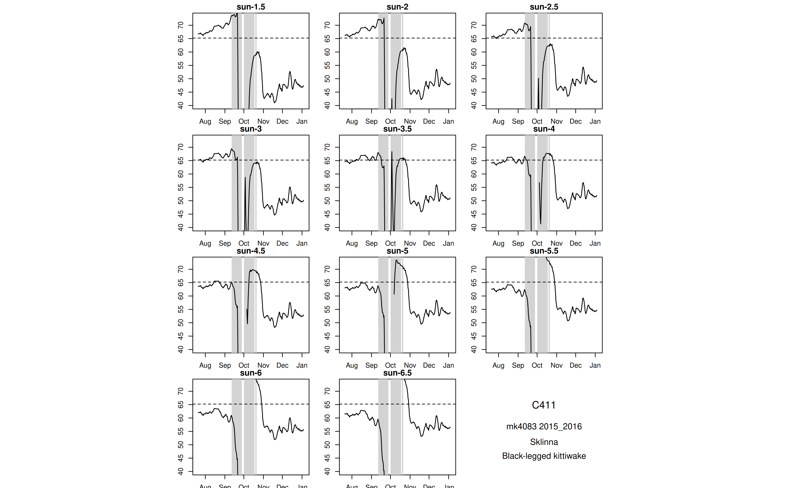
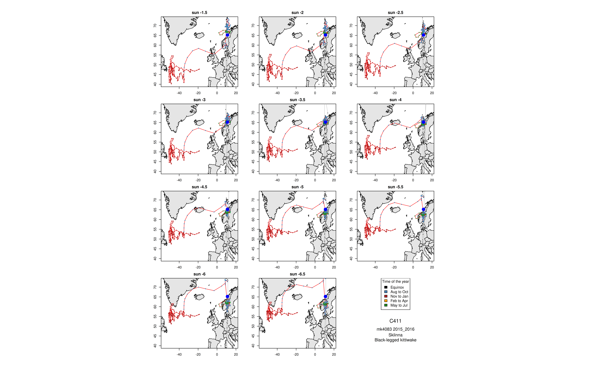
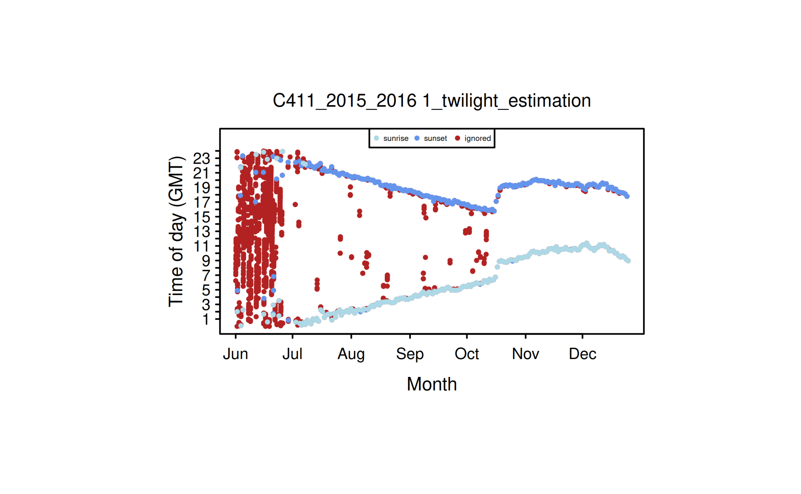
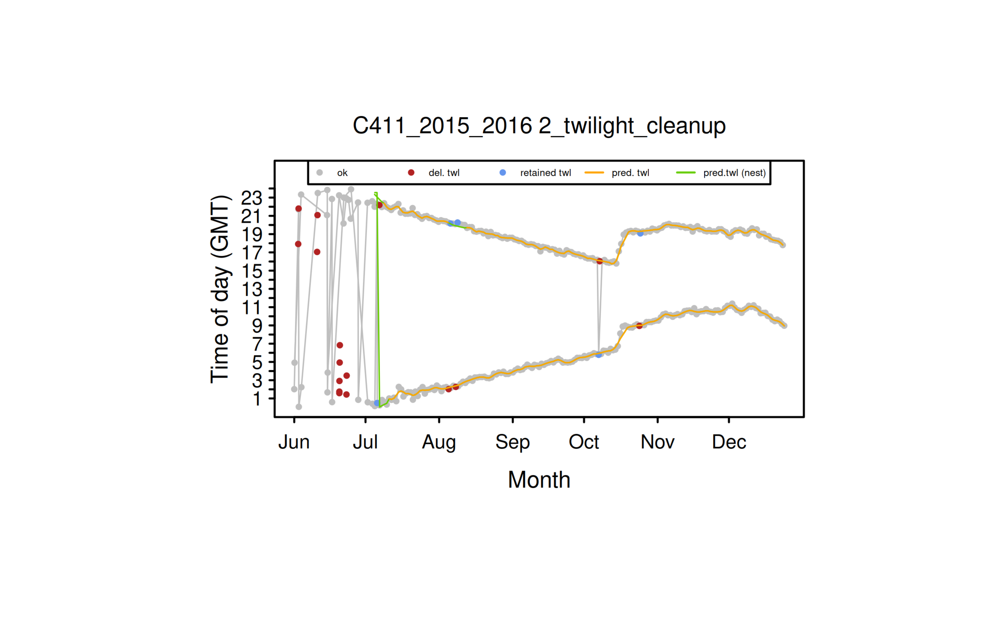
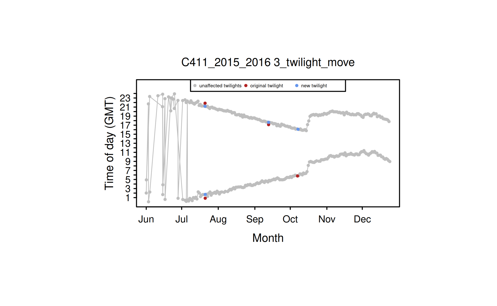
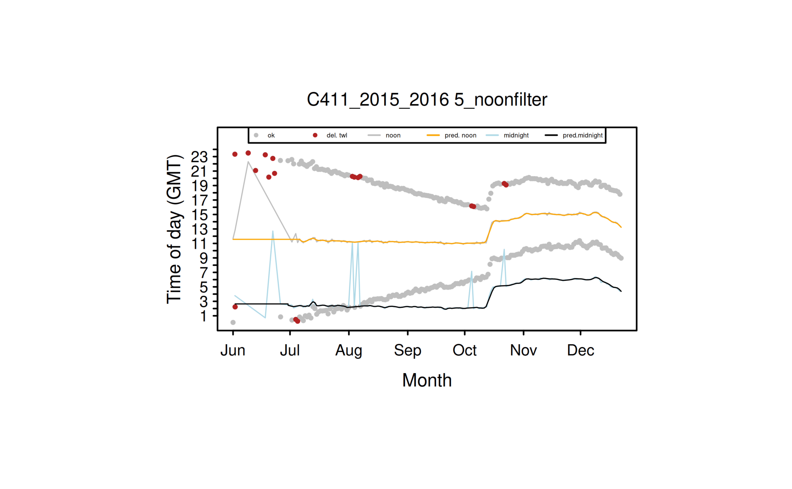

# workflow tutorial

``` r
library(seatrackRgls)
knitr::opts_chunk$set(
  collapse = TRUE,
  comment = "#>"
)
```

Prepare basic metadata for calibration. Basic metadata must have
`logger_id`, `logger_model`, `species`, `colony`, `date_deployed`,
`date_retrieved` columns. It is expected to be one row per
logger/retrieval year combination.

``` r
print(example_metadata)
#>   logger_id logger_model date_deployed date_retrieved  colony
#> 1      C411       mk4083    2015-06-11     2017-06-11 Sklinna
#>                  species
#> 1 Black-legged kittiwake
```

Prepare colony information. Colony information must have `colony`,
`col_lat`, `col_lon` columns.

``` r
print(example_colony_info)
#>    colony col_lat col_lon
#> 1 Sklinna  65.202  10.995
```

Set your import directory, where your light data is placed. Light data
is expected to be in the format
`<logger_id>_<year_retrieved>_<logger_model>`, e.g. `C411_2017_mk4083`

``` r
import_dir <- "light_data"
```

``` r
print(list.files(import_dir))
#> [1] "C411_2017_mk4083.lig"
```

Also set up an export directory, where all outputs will be saved.

``` r
export_dir <- "processed_light_data"
```

With all this loaded, you can now carry out the first step which is to
calibrate your data. To assist in this, there is an initial round of
processing that generates helpful plots to choose calibration values

``` r
prepare_calibration(
  import_directory = import_dir,
  metadata = example_metadata,
  all_colony_info = example_colony_info,
  output_dir = export_dir
)
```

You will find the calibration plots in the `sun_calib` folder created on
your `output_dir`.





Stare at these plots. Use the force.

By default, this code will also have generated an excel file in the
`calibration` folder. You can use this to enter your calibration values.


You must fill in at least the sun_angle_start column. It is also
reccomended to include your name in the analyzer column.

Once you have filled in your calibration template, you can use these
values to process the light data and export positions.

We can pass a path to the calibration data file:

``` r
calibration_data_path <- file.path(export_dir, "calibration", "calibration.xlsx")
```

At this stage, we might want to include some extra relevant information
in the final data output.

``` r
print(example_extra_metadata)
#>   logger_id date_retrieved logger_producer ring_number country_code
#> 1      C411     2017-06-11        Biotrack     6211704          NOS
```

The final positions are now exported to your `output_dir`.

``` r
head(positions)
#>   logger_id logger_id_year total_years_tracked logger_model start_datetime
#> 1      C411      C411_2016           2015_2016       mk4083     2015-06-12
#> 2      C411      C411_2016           2015_2016       mk4083     2015-06-12
#> 3      C411      C411_2016           2015_2016       mk4083     2015-06-12
#> 4      C411      C411_2016           2015_2016       mk4083     2015-06-12
#> 5      C411      C411_2016           2015_2016       mk4083     2015-06-12
#> 6      C411      C411_2016           2015_2016       mk4083     2015-06-12
#>          end_datetime year_tracked                species
#> 1 2016-01-05 23:59:59    2015_2016 Black-legged kittiwake
#> 2 2016-01-05 23:59:59    2015_2016 Black-legged kittiwake
#> 3 2016-01-05 23:59:59    2015_2016 Black-legged kittiwake
#> 4 2016-01-05 23:59:59    2015_2016 Black-legged kittiwake
#> 5 2016-01-05 23:59:59    2015_2016 Black-legged kittiwake
#> 6 2016-01-05 23:59:59    2015_2016 Black-legged kittiwake
#>                    date_time  sun_angle eqfilter    lon_raw  lat_raw
#> 1 2015-06-26 23:52:50.877155 -0.5000000     TRUE   2.513619 55.27382
#> 2      2015-06-27 11:53:03.5 -0.5022321     TRUE   2.487036 55.31046
#> 3        2015-06-27 23:08:04 -0.5044643     TRUE  13.759251 60.39885
#> 4        2015-06-29 11:51:13 -0.5111607     TRUE   3.049667 63.94152
#> 5   2015-07-02 00:49:34.1875 -0.5133929     TRUE -11.413749 62.65435
#> 6 2015-07-03 00:53:24.666667 -0.5156250     TRUE -12.326723 63.02963
#>   lon_smooth1 lat_smooth1        lon      lat                    tFirst
#> 1    2.513619    55.25641   2.506975 55.26563 2015-06-26 20:31:44.37931
#> 2    2.500327    55.27485   5.216402 56.58849   2015-06-27 03:13:57.375
#> 3    8.123143    57.83874   9.619807 59.51800   2015-06-27 20:32:09.625
#> 4    6.510926    63.12527   6.510926 63.12527       2015-06-29 01:34:41
#> 5  -11.413749    62.64140 -11.413749 62.64140       2015-07-01 22:40:07
#> 6  -12.326723    63.01702  -8.043379 63.17219       2015-07-02 22:48:38
#>                      tSecond type  colony col_lat col_lon sun_angle_start
#> 1    2015-06-27 03:13:57.375    2 Sklinna  65.202  10.995            -0.5
#> 2    2015-06-27 20:32:09.625    1 Sklinna  65.202  10.995            -0.5
#> 3    2015-06-28 01:43:58.375    2 Sklinna  65.202  10.995            -0.5
#> 4        2015-06-29 22:07:45    1 Sklinna  65.202  10.995            -0.5
#> 5    2015-07-02 02:59:01.375    2 Sklinna  65.202  10.995            -0.5
#> 6 2015-07-03 02:58:11.333333    2 Sklinna  65.202  10.995            -0.5
#>   sun_angle_end light_threshold noon_filter daylength_filter coast_to_land
#> 1         -1.25              50        TRUE             TRUE           100
#> 2         -1.25              50        TRUE             TRUE           100
#> 3         -1.25              50        TRUE             TRUE           100
#> 4         -1.25              50        TRUE             TRUE           100
#> 5         -1.25              50        TRUE             TRUE           100
#> 6         -1.25              50        TRUE             TRUE           100
#>   coast_to_sea loess_filter_k months_breeding_start months_breeding_end
#> 1          Inf              6                     4                   8
#> 2          Inf              6                     4                   8
#> 3          Inf              6                     4                   8
#> 4          Inf              6                     4                   8
#> 5          Inf              6                     4                   8
#> 6          Inf              6                     4                   8
#>   boundary.box_xmin boundary.box_xmax boundary.box_ymin boundary.box_ymax
#> 1               -95               100                30                88
#> 2               -95               100                30                88
#> 3               -95               100                30                88
#> 4               -95               100                30                88
#> 5               -95               100                30                88
#> 6               -95               100                30                88
#>         analyzer date_retrieved logger_producer ring_number country_code
#> 1 Kate Kittiwake     2017-06-11        Biotrack     6211704          NOS
#> 2 Kate Kittiwake     2017-06-11        Biotrack     6211704          NOS
#> 3 Kate Kittiwake     2017-06-11        Biotrack     6211704          NOS
#> 4 Kate Kittiwake     2017-06-11        Biotrack     6211704          NOS
#> 5 Kate Kittiwake     2017-06-11        Biotrack     6211704          NOS
#> 6 Kate Kittiwake     2017-06-11        Biotrack     6211704          NOS
```

Note our extra metadata appended to the end.

Maps are automatically exported.


It is worth examining the filter plots too.











