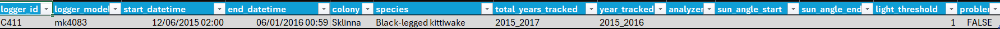

```{r setup}
library(seatrackRgls)
knitr::opts_chunk$set(
  collapse = TRUE,
  comment = "#>"
)
```

Prepare basic metadata for calibration. Basic metadata must have
`logger_id`, `logger_model`, `species`, `colony`, `date_deployed`, `date_retrieved` columns. It is expected to be one row per logger/retrieval year combination.

```{r example_metadata}
print(example_metadata)
```

Prepare colony information. Colony information must have `colony`, `col_lat`, `col_lon` columns.

```{r example_colony_info}
print(example_colony_info)
```

```{r echo = FALSE}
import_dir <- fs::path_package("exdata/light_data", package = "seatrackRgls")
export_dir <- tempdir()
```

Set your import directory, where your light data is placed. Light data is expected to be in the format `<logger_id>_<year_retrieved>_<logger_model>`, e.g. `C411_2017_mk4083`

```{r dummy_import_dir, eval = FALSE}
import_dir <- "light_data"
```

```{r show_dir}
print(list.files(import_dir))
```

Also set up an export directory, where all outputs will be saved.

```{r dummy_output_dir, eval = FALSE}
export_dir <- "processed_light_data"
```

With all this loaded, you can now carry out the first step which is to calibrate your data. To assist in this, there is an initial round of processing that generates helpful plots to choose calibration values

```{r dummy_calibrate, eval = FALSE}
prepare_calibration(
  import_directory = import_dir,
  metadata = example_metadata,
  all_colony_info = example_colony_info,
  output_dir = export_dir
)
```

```{r calibrate, echo = FALSE, warning = FALSE, message = FALSE, results = FALSE}
# We don't need the interrim excel file
calibration_template <- prepare_calibration(
  import_directory = import_dir,
  metadata = example_metadata,
  all_colony_info = example_colony_info,
  output_dir = export_dir,
  export_calibration_template = FALSE
)
```


You will find the calibration plots in the `sun_calib` folder created on your `output_dir`. 

```{r calib_plot_blocks, echo = FALSE}

img_from_path <- function(current_dir, x){
    all_files <- list.files(current_dir)
    current_path <- file.path(current_dir, all_files[x])
    current_path <- normalizePath(current_path)
  if (grepl("tiff", basename(current_path), fixed = TRUE)) {
    grid::grid.raster(tiff::readTIFF(current_path))
  }else {
    grid::grid.raster(png::readPNG(current_path))
  }
}


sun_calib_path <- file.path(export_dir, "sun_calib")
calib_plots <- lapply(c(1:2), function(x) {
    knitr::knit_expand(text = c(
        "```{r calibplot_{{x}}, echo=FALSE, fig.align = 'center', out.width = '100%', dpi=600}",
        "img_from_path(sun_calib_path, {{x}})",
        "```",
        "  ")
        )
})
```

`r paste(knitr::knit(text = calib_plots), collapse = '\n')`

Stare at these plots. Use the force.

By default, this code will also have generated an excel file in the `calibration` folder. You can use this to enter your calibration values.

```{r screenshot, out.width = '90%', echo = FALSE}

```

You must fill in at least the sun_angle_start column. It is also reccomended to include your name in the analyzer column.

Once you have filled in your calibration template, you can use these values to process the light data and export positions.

We can pass a path to the calibration data file:
```{r dummy_set_calibration_path, eval = FALSE}
calibration_data_path <- file.path(export_dir, "calibration", "calibration.xlsx")
```

```{r set_calibration_data, echo = FALSE}
calibration_data_path <- calibration_template
calibration_data_path$sun_angle_start <- -3.5
calibration_data_path$analyzer <- "Kate Kittiwake"
```

At this stage, we might want to include some extra relevant information in the final data output. 

```{r example_extra_metadata}
print(example_extra_metadata)
```

```{r run_process, echo = FALSE, warning = FALSE, message = FALSE, results = FALSE}
process_positions(
  import_directory = import_dir,
  calibration_data = calibration_data_path,
  all_colony_info = example_colony_info,
  output_dir = export_dir,
  extra_metadata = example_extra_metadata
)
```

The final positions are now exported to your `output_dir`. 

```{r load_in_positions, echo = FALSE}
pos_dir <- file.path(export_dir, "processed_positions")
position_file_name <- list.files(pos_dir)[1]
positions <- read.csv(file.path(pos_dir, position_file_name))
```

```{r show_positions}
head(positions)
```

Note our extra metadata appended to the end.

Maps are automatically exported.

```{r plot positions, out.width = '100%', dpi=600, echo = FALSE}
map_path <- file.path(export_dir, "maps")
current_path <- file.path(map_path, list.files(map_path)[1])
grid::grid.raster(png::readPNG(current_path))
```

It is worth examining the filter plots too.

```{r filter_plot_blocks, echo = FALSE}
filter_plot_path <- file.path(export_dir, "filter_plots")
all_filter_plots <- list.files(filter_plot_path)
filter_plots <- lapply(seq_along(all_filter_plots), function(x) {
    knitr::knit_expand(text = c(
        "```{r filterplot_{{x}}, echo=FALSE, fig.align = 'center', out.width = '100%', dpi=600}",
        "img_from_path(filter_plot_path, {{x}})",
        "```",
        "  ")
        )
})
```

`r paste(knitr::knit(text = filter_plots), collapse = '\n')`